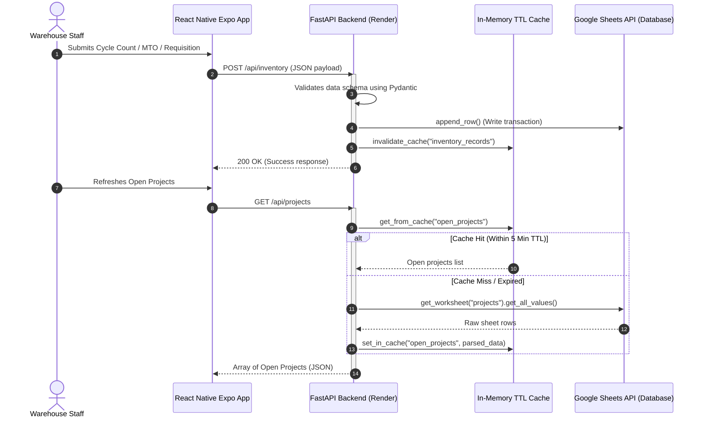
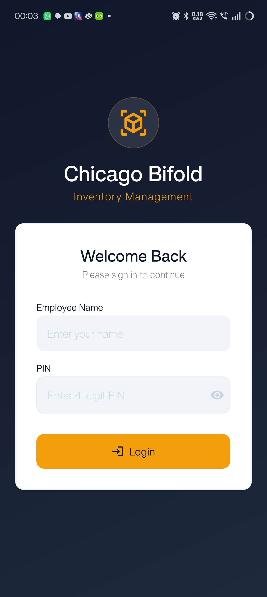
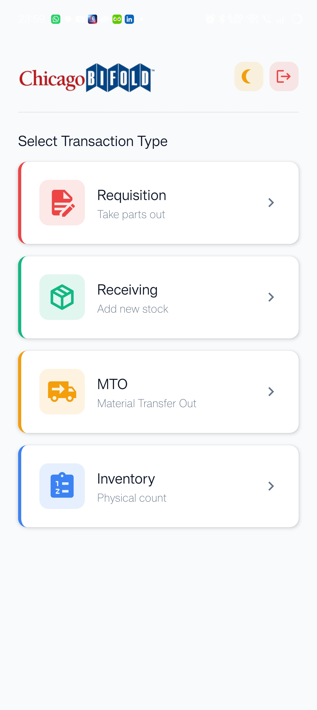
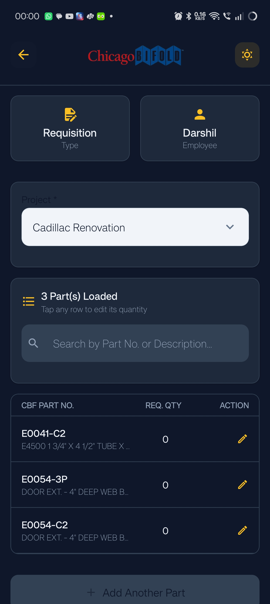
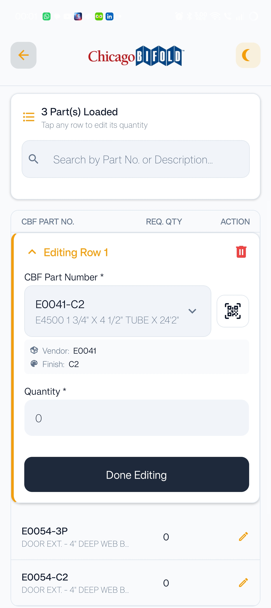
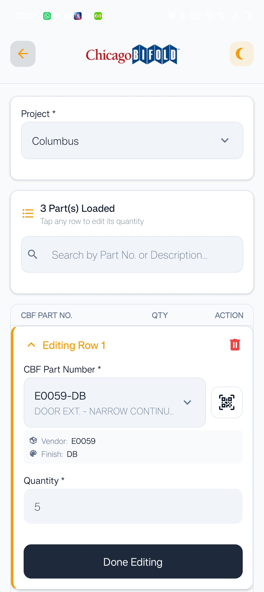
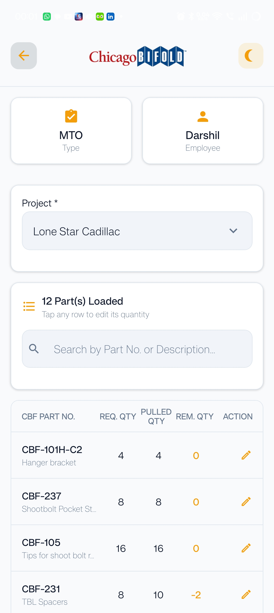
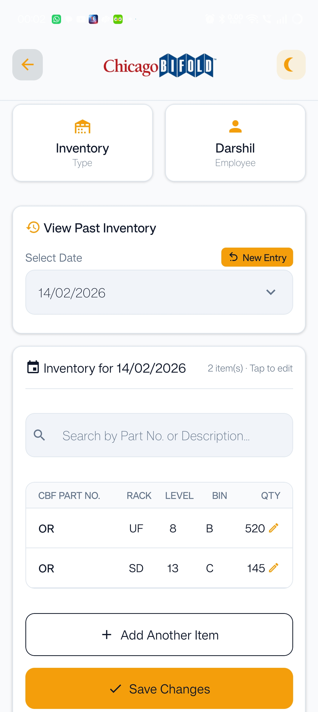

# Chicago Bifold Inventory Management System

[](https://fastapi.tiangolo.com)
[](https://reactnative.dev)
[](https://expo.dev)
[](https://www.typescriptlang.org)
[](https://developers.google.com/sheets/api)
[](#)

A production-ready, cross-platform mobile application (iOS/Android) and backend API designed to streamline warehouse inventory tracking, order preparation, and cycle counts for **Chicago Bifold**. 

This system uses a serverless-style **Google Sheets database architecture** combined with a high-performance **FastAPI caching proxy**. It enables real-time updates and zero-cost database maintenance, while scaling past Google Cloud rate-limits.

---

## 🏗️ System Architecture

The following diagram illustrates how the frontend app communicates with the FastAPI service, which coordinates with an in-memory TTL caching layer to read and write rows to the Google Sheets workbook.



---

## ⚡ Technical Highlights & Features

*   **Sheets-as-a-Database (gspread)**: Fully operational Google Sheets integration. Replaces expensive SQL database setups with a collaborative workbook that non-technical office staff can view, format, and audit in real-time.
*   **High-Performance Caching Layer**: Prebuilds an `O(1)` parts lookup map in server memory. Employs a per-key TTL (Time-To-Live) cache on `gspread` query outputs to bypass Google Sheets' strict API limit (300 requests/minute) and keep endpoint latencies under 150ms.
*   **HMAC-SHA256 PIN Authentication**: Implements robust PIN-based employee authentication. PINs are salted and hashed on the server using HMAC-SHA256, protecting credentials while maintaining backward-compatibility with legacy plaintext configurations.
*   **Batch Request Log Ingestion**: Ingests multiple records in a single transactional payload (e.g. batch requisition or receiving logs) to minimize API round-trips and sheet write latency.
*   **Cross-Platform Mobile Experience**: Built with **Expo (React Native)** and **TypeScript**. Features a tabbed dashboard with modal forms, cycle count shelf-address logging (Rack/Level/Bin), pull-to-refresh list syncing, and loading indicators.
*   **Responsive Marketing Site**: Beautifully structured landing page built with vanilla HTML/CSS and JavaScript to pitch the mobile app features.

---

## 📂 Codebase Directory Structure

```
├── .github/workflows/       # GitHub Actions CI/CD workflows
├── backend/                 # FastAPI REST API Backend
│   ├── server.py            # Primary REST API implementation, security & caching
│   ├── requirements.txt     # Python dependencies
│   ├── pyproject.toml       # Ruff formatting and linting configuration
│   └── service_account.json # (Gitignored) Google Sheets service account credentials
├── frontend/                # React Native (Expo) Mobile App
│   ├── app/                 # Expo Router file-based screens (Tabs, Auth, Transactions)
│   ├── components/          # Reusable React Native UI widgets
│   ├── constants/           # Design tokens, colors, layouts
│   ├── contexts/            # Global Auth & State React Contexts
│   ├── eslint.config.js     # JavaScript/TypeScript linting configuration
│   └── package.json         # Yarn project configuration
├── landing-page/            # Vanilla HTML/CSS website showcasing the product
└── tests/                   # Automated backend testing suite
    └── test_backend.py      # Mocked gspread unit tests for FastAPI (Pytest)
```

---

## 🔧 Installation & Local Setup

### Prerequisites
*   Python 3.11+
*   Node.js 18+ and Yarn / npm
*   Google Sheets API service account key file (`service_account.json`)

### 1. Backend Setup
Navigate to the backend directory, configure environment variables, and launch the development server:
```bash
cd backend
python -m venv .venv
# On Windows:
.venv\Scripts\activate
# On macOS/Linux:
source .venv/bin/activate

pip install -r requirements.txt
```

Create a `.env` file inside `backend/`:
```env
PIN_SECRET=your-secure-hmac-salt-secret
# Add other backend configurations if needed
```

Place your Google service account credentials JSON key at `backend/service_account.json`. (Make sure it is shared with the spreadsheets workbook as an Editor).

Run the backend:
```bash
python server.py
```
The REST API server will start on `http://localhost:8001`.

### 2. Frontend Setup
Navigate to the frontend directory, install npm packages, and run the Expo Packager:
```bash
cd ../frontend
yarn install
```

Create a `.env` file inside `frontend/`:
```env
EXPO_PUBLIC_BACKEND_URL=http://localhost:8001
```

Run the development server:
```bash
yarn start
```
Use the Expo Go app or an emulator (iOS/Android) to scan the QR code and test the app.

---

## 🧪 Testing

We use **Pytest** for backend route verification. The test suite is completely mocked using Python's `unittest.mock` to avoid making physical calls to Google Sheets, allowing developers to execute test suites offline in seconds.

To run tests:
```bash
cd backend
# Make sure virtual environment is active
pip install pytest
pytest ../tests/test_backend.py -v
```

---

## 📲 Screenshots & User Flow

Below is the step-by-step user workflow of the mobile application, showcasing its responsive dark/light modes and key features:

| 1. Employee Login | 2. Transaction Dashboard | 3. Active Requisitions |
| :---: | :---: | :---: |
|  |  |  |

| 4. Edit Qty & QR Scanner (Light) | 5. Edit Qty (Columbus Project) | 6. Make-to-Order (MTO) Status |
| :---: | :---: | :---: |
|  |  |  |

| 7. Inventory Cycle Counts |
| :---: |
|  |

---

## 📜 License

This project is licensed under the MIT License - see the [LICENSE](LICENSE) file for details.